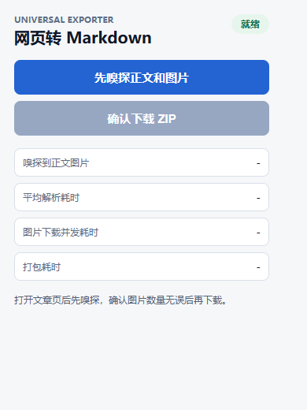
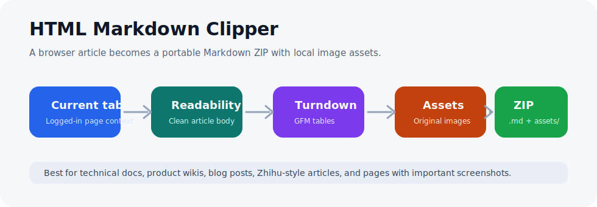

# HTML Markdown Clipper

Save a web article as a clean Markdown ZIP: readable text, preserved tables, and original images in `assets/`.

HTML Markdown Clipper is a Chrome/Edge extension for people who collect serious web material into Obsidian, Git repos, notes, docs, or knowledge bases. Open an article, click once, and get a portable Markdown package instead of a messy copy-paste.



## Why Star This

- One-click article capture: Markdown plus local image assets.
- Keeps real article images instead of hotlinking remote URLs.
- Cleans sidebars, ads, recommendations, comments, avatars, and navigation.
- Preserves useful Markdown tables for docs, wiki pages, and technical articles.
- Works from the page context first, so logged-in article images have a better chance to download.
- Ships with regression tests for Bambu Wiki, Zhihu-like pages, WordPress lazy images, and table conversion.

## What You Get



```text
Article Title.zip
├── Article Title.md
└── assets/
    ├── image1.png
    ├── image2.jpg
    └── image3.webp
```

Inside the Markdown, image links are rewritten to local paths:

```markdown

```

## Quick Start

Clone and build:

```bash
git clone https://github.com/yinbaozong/html-markdown-clipper.git
cd html-markdown-clipper
npm install
npm run build
```

Load it in Chrome or Edge:

1. Open `chrome://extensions/` or `edge://extensions/`.
2. Enable Developer mode.
3. Click Load unpacked.
4. Select the generated `dist/` folder.
5. Pin the extension if you want one-click access.

Export your first article:

1. Open an article page.
2. Click the extension icon.
3. Click the sniff button to preview title and image count.
4. Click Download Markdown ZIP.
5. Unzip the file and drop the Markdown folder into Obsidian or any docs repo.

## Need Help?

If you want to reproduce this project but are not sure how to start, feel free to contact me anytime: yinbaozong@163.com

## Good Targets

- Zhihu columns and long answers
- Bambu Wiki and product docs
- CSDN, blog posts, and technical tutorials
- WordPress articles with lazy-loaded images
- Documentation pages with tables and screenshots

Some sites block image downloads or require login. Open the page normally in your browser first, then run the extension from that same tab.

## How It Works

- `src/content/content.js` clones the current page, lazy-loads images, removes noisy blocks, and extracts the best article body.
- `@mozilla/readability` provides the first article parse.
- Site-aware fallback selectors preserve content Readability may miss.
- `src/shared/markdown.js` converts HTML to Markdown with Turndown and GFM table support.
- `src/shared/downloadImages.js` downloads article images concurrently.
- `src/shared/zip.js` builds the final Markdown ZIP with JSZip.

## Verification

These commands are expected to pass before publishing changes:

```bash
npm run test:extract
npm run test:perf:5
npm run build
```

Current local verification:

- `test:extract`: passed
- `test:perf:5`: passed, average total simulated response about 90 ms with 5 images
- `build`: passed and generated `dist/`

## Development

Install dependencies:

```bash
npm install
```

Run tests:

```bash
npm run test:extract
npm run test:perf
```

Build after editing:

```bash
npm run build
```

Reload the unpacked extension in the browser extensions page after every build.

## Troubleshooting

- Extension still shows old behavior: click Reload on the extension card, or remove and load `dist/` again.
- Images are missing: make sure the page is fully loaded and you are logged in if the site requires it.
- Markdown has extra page chrome: open an issue with the target URL and a short HTML sample if possible.
- Download is blocked: check browser download permissions and retry with Save As enabled.
